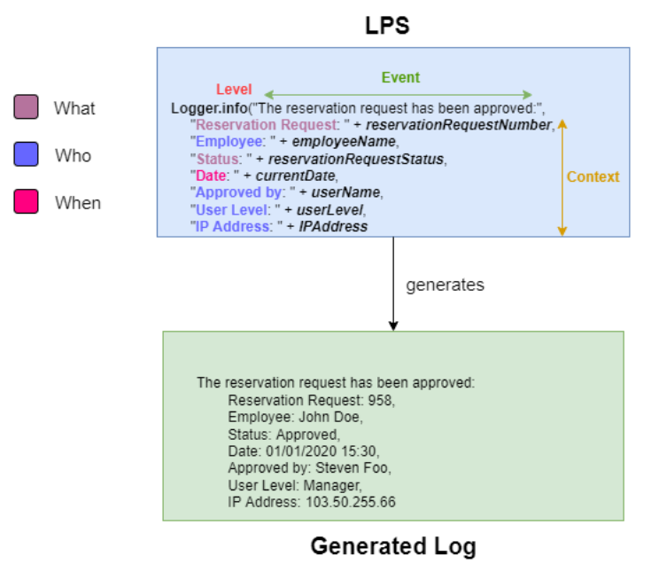
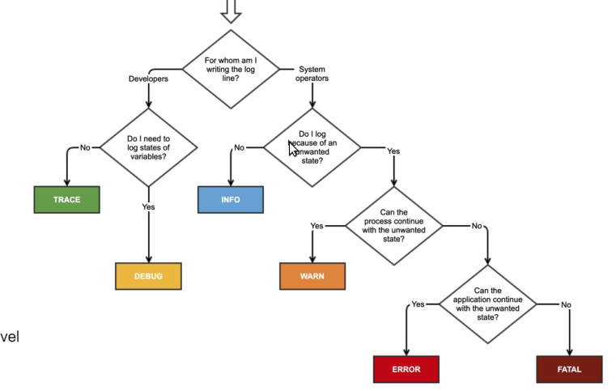
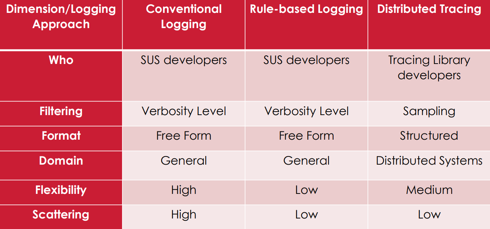
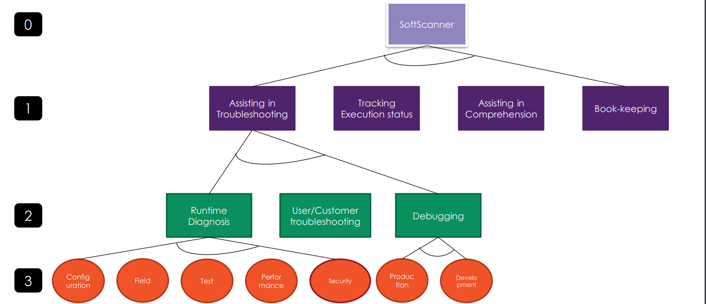
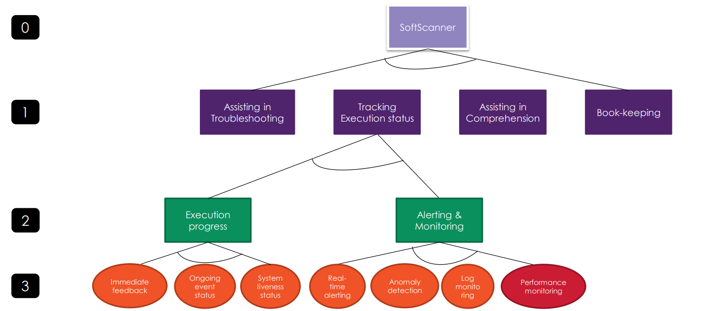
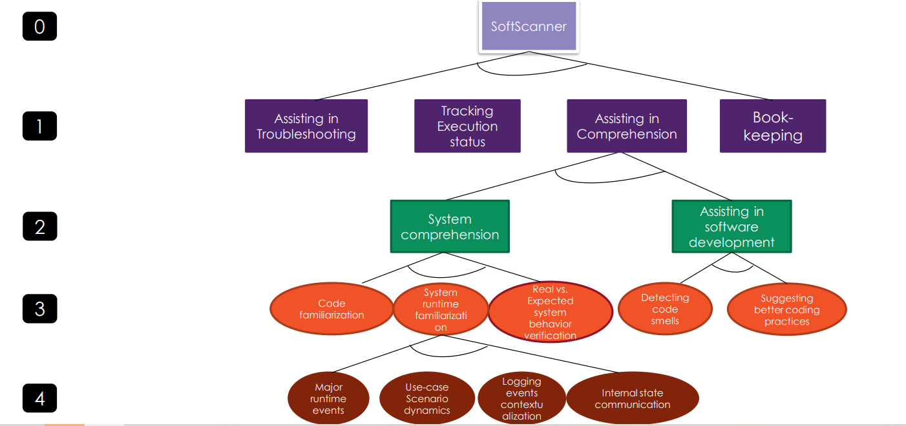
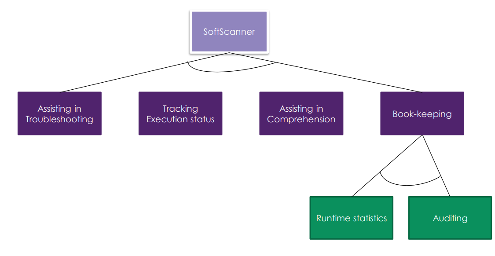
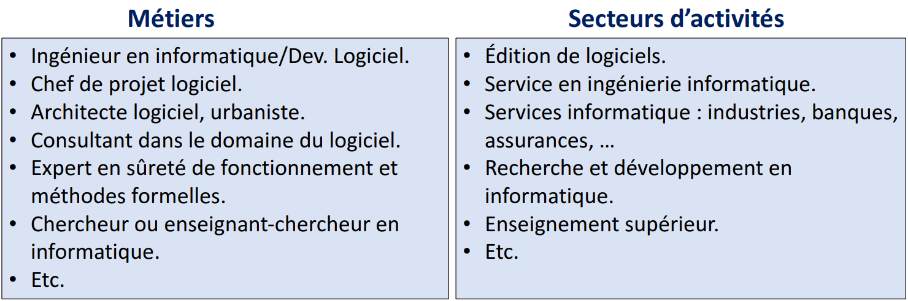

# GL - Génie Logiciel

## Bachar Rima: Softscanner

### Problèmes avec les prints
- **Éphémère** : Les prints disparaissent après l'exécution.
- Pas de filtrage pour décider quand print quoi.
- Pas de distribution des messages, ils apparaissent seulement dans la console.

### Log Printing Statement (LPS)
- Opérations injectées dans le code source pour accomplir un "logging goal" et générer des logs.
- **LPS event** : Événement récupéré du LPS.
- **LPS context** : Les éléments utilisés pour construire un LPS event.
- **Who** : Qui a déclenché l'événement.
- **When** : Quand a-t-il été déclenché.
- **Where** : Où a-t-il été déclenché.
- **What** : Quelle information extraire du log.
- **Why** : Pourquoi l'événement a-t-il été déclenché.

- **LPS level** : Niveau d'importance du log (du plus grave au plus chill).
  - Fatal
  - Error
  - Warn
  - Info
  - Debug
  - Trace

### Approches de logging
- **Conventional Logging** : Logging à forme libre, peut être écrit partout dans le code.
- **Rule-based Logging** : Logging à forme libre, modularisé dans des fichiers à part.
- **Distributed Tracing** : Logging structuré utilisant des traces end-to-end pour capturer plus d'informations sur les machines dans un système de distribution.

### Problèmes avec Rule-based Logging et Distributed Tracing
- Beaucoup d'entreprises utilisent toujours l'approche de Conventional Logging.
- Elles sont plus difficiles à prendre en main.
- Il existe des bibliothèques (SLF4, Log4j, Spdlog, etc.) pour aider à logger et avoir plus de fonctionnalités.
- Il existe des approches de log automatiques mais elles sont soit incomplètes (ne répondent pas à toutes les questions Wh - who, what, why) ou très coûteuses.

### SOFTSCANNER
- Écosystème log-centrique d'ingénierie et d'analyse de logiciel.
- Semi-automatique.
- Supporte la nécessité de différents logging goals à la fois.
- Propose plusieurs stratégies de logage pour être complet.
- Optimiseur de LPS.

Big resume de ce qu’il fait en 4 graphes courage pour comprendre ca 

### Logging des widgets GUI basés sur les événements
- Objectif : Offrir un mécanisme de log pour les widgets GUI de projets Angular.
- Log automatiquement toutes les widgets sur lesquelles on peut appliquer les événements demandés.
- Supporte plusieurs événements différents (click, submit, href, FocusOut, change, file).

### Exploration GUI
- Objectif : Modéliser les GUI d'une application web et l'utiliser pour différentes tâches d'analyse ou d'ingénierie logicielle.
- Construit un modèle GUI comportant des états de GUI et transitions utilisant DFS graph exploration et Selenium pour simuler l'interaction.
- États GUI : Série de widgets exécutables.
- Transition d'états GUI : État source, de destination, qui cause la transition, et l'état source où l'événement a été déclenché.

## Djamel Seriai, présentation du master
- Objectif : Former des experts et cadres en informatique dans le domaine du Génie Logiciel.

- Génie Logiciel : Science de génie industriel étudiant les méthodes de travail des ingénieurs développant des logiciels.
- C'est un mélange de la science et de l'art de l'ingénieur appliqué dans le domaine du logiciel.

### Dates
- **1950 à 1960** : Les logiciels étaient développés par des membres des institutions pour leurs propres besoins.
- **Jusqu'en 1985** : Les ordinateurs appartenaient à des sociétés ou des institutions.
- **En 1970** : Nouvelles notions telles que le multi-utilisateur, les interfaces graphiques, la programmation concurrente, les bases de données et le temps réel.
- **Depuis 1973 et surtout avec l'apparition des ordinateurs personnels en 1980** : Le logiciel devient un bien de grande distribution.
- **Entre 1985 et le début des années 2000** : Le logiciel passe du statut de produit standalone indépendant à celui d'élément d'un ensemble.

### Cycle de vie du logiciel
1. Analyse des besoins et faisabilité.
2. Conception générale.
3. Conception détaillée.
4. Codage.
5. Tests unitaires.
6. Intégration.
7. Qualification.
8. Déploiement et mise en production.
9. Maintenance.

### Compétences du Master (Slides 20-38)
- Comment construire des logiciels modulaires : les architectures logicielles.
- Comment définir des architectures avancées du web.
- Comment définir des architectures logicielles distribuées.
- Programmation répartie/concurrente.
- Développement et programmation pour supports mobiles.
- Développement mobile avancé, IoT et embarqué.
- Ingénierie des modèles.
- Systèmes réflexifs, models@runtime.
- La compilation.
- Conduire et gérer un projet informatique.
- Assurer la sécurité des logiciels.
- Évolution et restructuration des logiciels.
- Gestion des données au-delà de SQL (NoSQL).
- IA pour le génie logiciel.
