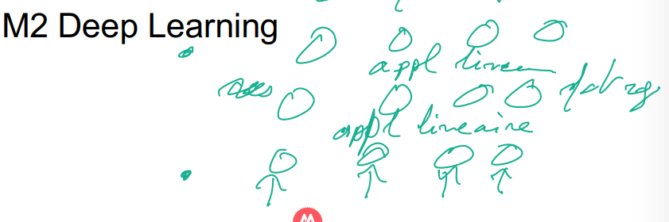
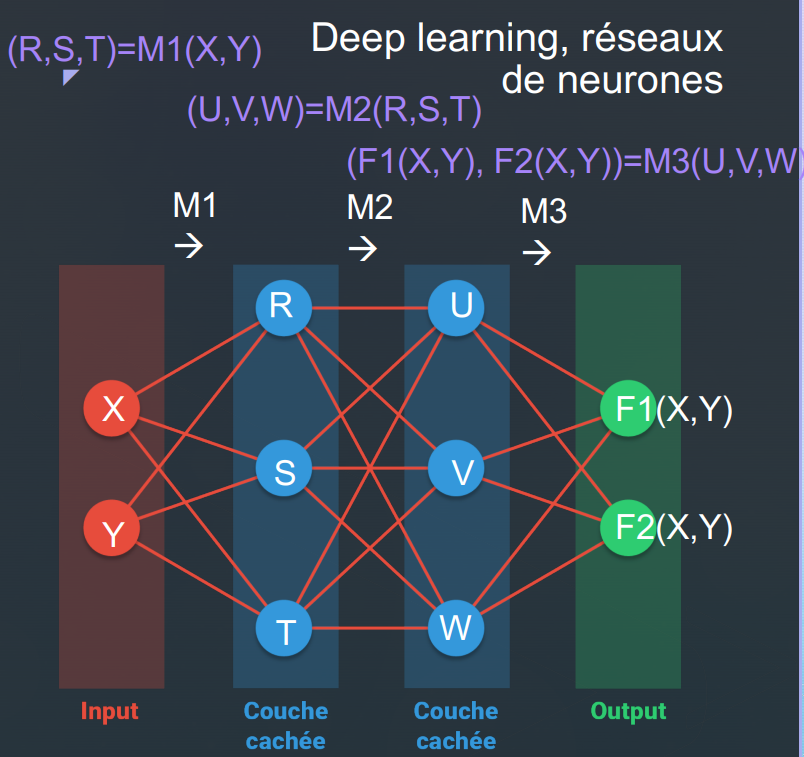
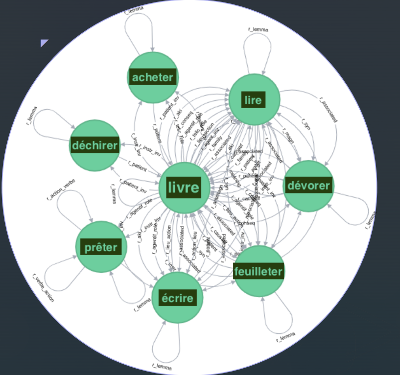
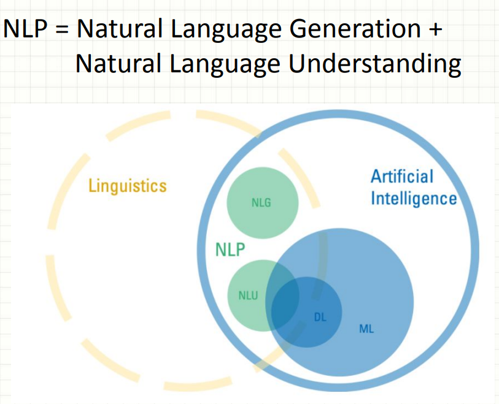

# IASD - Notes de Cours (Christian Retoré)

## Introduction
Cours généraux de master informatique au début puis au fil des semestres, de plus en plus IASD: Données, Apprentissage, langage naturel, IA symbolique(représentation des connaissances, modélisation du raisonnement)

## Big Data
- Science des données 
- Langage : Syntaxe, sémantique des mots et de la phrase

## Données
- BD SGBD entrepôts de données
- BD semi-structurées XML
- BD déductives (Programmation logique data log)
- Programmations web

## IA Symbolique
- Modélisation des connaissances (Logique de descriptions) 
- Raisonnement sur les connaissances (Interrogations plus complexes que SQL) 
- Systèmes Multi-Agents et logique épistémique (muddy children) 
- Programmation logique par contrainte

## Logique pour l'IA et le GL
- Logiques modales 
- Logiques épistémiques (Système multi-agents) 
- Logiques temporelles (vérification de programmes et systèmes cyber-physiques) 
- Logiques de descriptions (bases de données, web sémantique ontologies)

## Langage naturel
- M1 Syntaxe : Programme l'analyse de phrase en français avec relatives accord correct
- M2 Sémantique : Logique premier ordre, formaliser les phrases (en gros)

## Machine Learning
- M1 Méthodes classiques : Classification, étiquetage
- M2 Deep Learning : Rien compris, y a marqué ça 

## Intelligence Artificielle
- Machine qui simule le comportement humain:
  - Raisonner, voir reconnaître, parler, comprendre, s'adapter, apprendre et acquérir des données

## Test de Turing
- Des personnes dialoguent via un écran et un clavier avec une machine ou un être humain
- 2/3 des personnes n’arrivent pas à faire la différence
- (1966) Eliza : Psychologue virtuel
- Tests Captcha à l'envers : La machine distingue un être humain d'une machine

## Langue
- Depuis la 2nde guerre mondiale, traduction automatique dès la seconde guerre mondiale
- Raisonnement (années 1970) : Systèmes experts, vérifications de circuits, preuves de programmes
- Langage codé et intraduisible : Enigma, Hopi pour enjeux militaires et économiques

## Traduction automatique
1. Enoncé à traduire (nettoyé: je l’appris à je le apprendre 1ère personne passé simple) 
2. (Analyse syntaxique, sémantique, discursive)
3. Représentation du sens (Langage pivot, logique+) 
4. (Génération dans le langage cible) 
5. Traduction marche très bien lorsque: domaine restreint, processus interactif

## Traduction automatique (moderne)
1. Alignement de corpus bilingue.
2. Traduction de d’expressions.
3. Lissage.
Aujourd'hui, la traduction automatique existe et peut être utile pour traiter de gros volumes de textes standardisés.

## Traitement automatique du langage naturel
- Moteur de recherche :
  - Tri & pertinence (Page ranking)
  - Expressions voisines (Production laitière / Production de lait, Production de voitures / Production automobile)
- Vecteurs de mots
- Autres outils :
  - Interrogation en langage naturel
  - Correcteurs orthographiques (Word / Synapse)
  - Résumé automatique : Méthode d’inversion

## Son
- Phonétique: Acoustique, traitement du signal 
- Phonologie: Automates Bali/Bari indistincts pour un Japonais

## Les mots
- Déclinaisons (pluriels) et conjugaisons, morphologie flexionnelle
- Automates et transducteurs
- Morphologie dérivationnelle = Forme automates et Sens: fonctions, logique d’ordre supérieur (maison/maisonnette)

## Parties du discours
- Catégories grammaticales, étiquetage grammatical
- Automates et Modèles de Markov cachés (probabilités)
- La (déterminent) voiture est en panne.

## Grammaire
- Syntaxe, grammaires formelles

## Sens des mots, sémantique lexicale
- Apprentissage, vecteurs de mots, Réseau Lexical construit par des jeux sérieux. Fonctions dans les logiques d’ordre supérieur

## Sémantique formelle
- Sens de la phrase (compositionnel, logique, formel)
- Formule logique (logique modale de premier ordre)
- Construit à partir du sens des ingrédients et de la structure grammaticale.
- Analyse du langage naturel (les ambiguïtés)

## Sens en contexte, pragmatique
- Contexte linguistique : Pierre a poussé Paul. Il est tombé.
- Contexte extralinguistique : Allons plutôt dîner dans ce restaurant.

## Vecteurs de mots
1. On se fixe une base de sens (les mots d’un thésaurus, par exemple)
2. Et grâce à la proximité des mots dans les textes, et à leur présence dans des textes, etc.
3. On associe un vecteur à un mot.
4. Puis en les combinant, à une phrase, à un texte etc.
- Mesure de similarité thématique: produit scalaire. Calcul très rapide. Nécessite beaucoup de données (Internet)  ex : Roi -- Homme -> Reine

## Apprentissage automatique, [machine learning](https://www.youtube.com/watch?v=0b2e_ANYtIE) 
- On apprend des fonctions de séquence vers des séquences: Nécessite de grandes capacités de calcul et Beaucoup de données, Aucune preuve de convergence

## Repérage de relations sémantiques, réseau JeuxDeMots (Lafourcade la fraude)
- Jeux sérieux (association d’idées simples, et relations plus complexes)
- 5*10^5 sommets (expressions) et 80*10^6 relations sémantiques de 100 sortes (lieu, agent, objet, …)Ces relations permettent d’identifier le sens du mot pertinent en contexte).

- Approche logique, Grail (Moot)
- Grammaire acquise sur corpus, 
- Analyse grammaticale: logique catégorielle (Lexique: Mot Mi à catégories Ci, Supertagging, C1…Cn à C la suite de mots M1 Mn est de catégorie C)
- Analyse grammaticale + sens des mots (calcul) à formule logique (plusieurs si ambiguïté)
- Prise en compte des glissements de sens (joker fourni par le lexique)

## Exemple d'analyse
- Barcelone est un grand port.
- Barcelone est un grand port et a remporté 5 ligues des champions.
- Sortes + glissement de sens +/- compatible.
- Glissements de sens fournis par JeuxDeMots

## Analyse de type Grail
- Formules logiques, puis démonstrateur automatique logique
- Apprentissage : résultats très supérieurs
- Mais si variation mineure du domaine (vocabulaire) par rapport au corpus d’apprent

## Argumentation / Débat (Suite)
- Approches statistiques : Classe les interventions (messages Twitter ou appréciations sur Amazon) en pour/contre
- Ignorent les énoncés comportant une négation car la portée de la négation leur échappe.

## Financement de la recherche
- ANR (Agence Nationale de la Recherche) et CE (Caisse d'Épargne) financent le domaine mathématique (probabilités et statistiques) et informatique (génie logiciel).
- Recherche financée par les GAFAM, qui ne couvrent pas tous les aspects du domaine.

## Conclusions
- Pas grand-chose de radicalement nouveau : Statistiques et probabilités anciennes, Réseaux de neurones (années 80), Apprentissage
- NLP = Natural Language Processing

