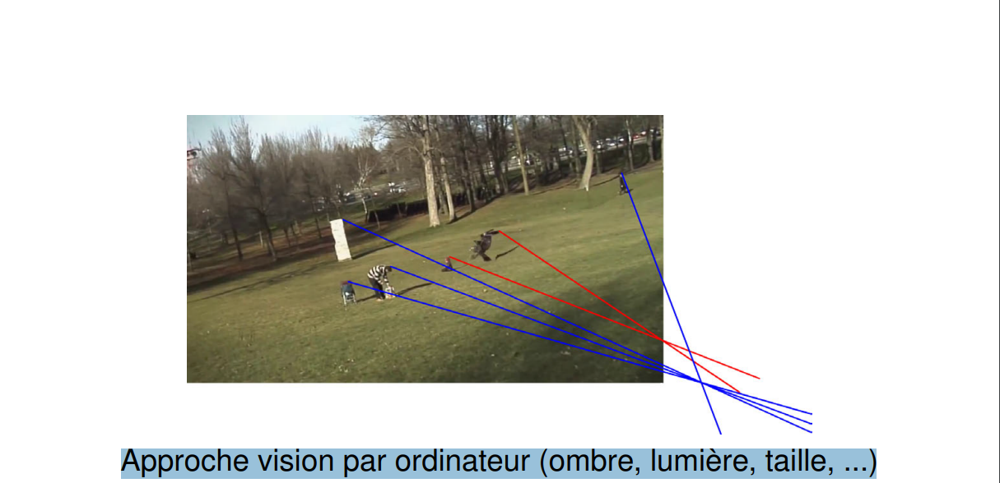
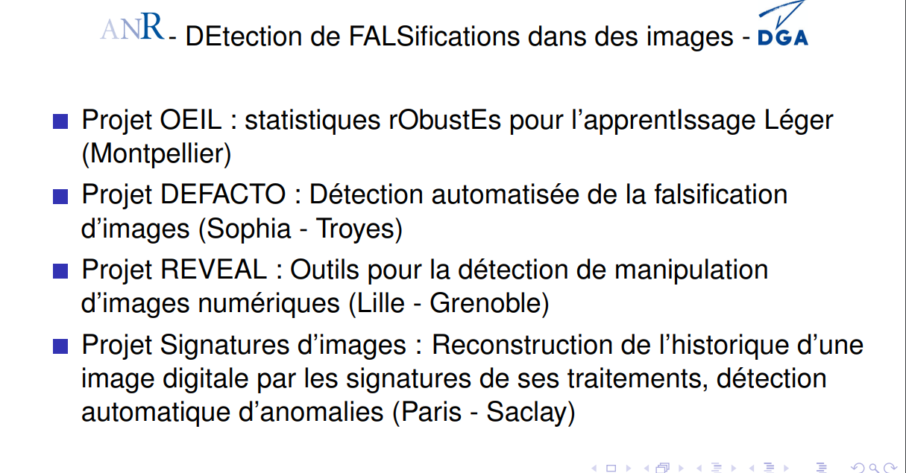
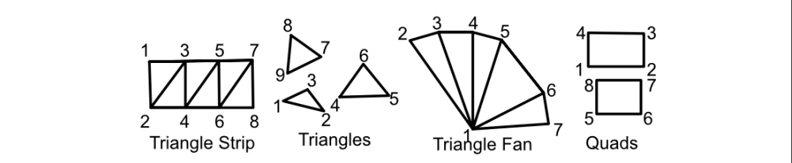
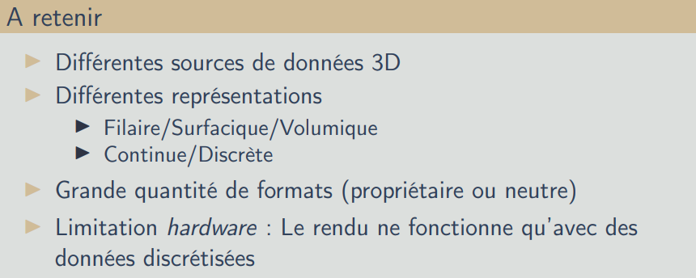
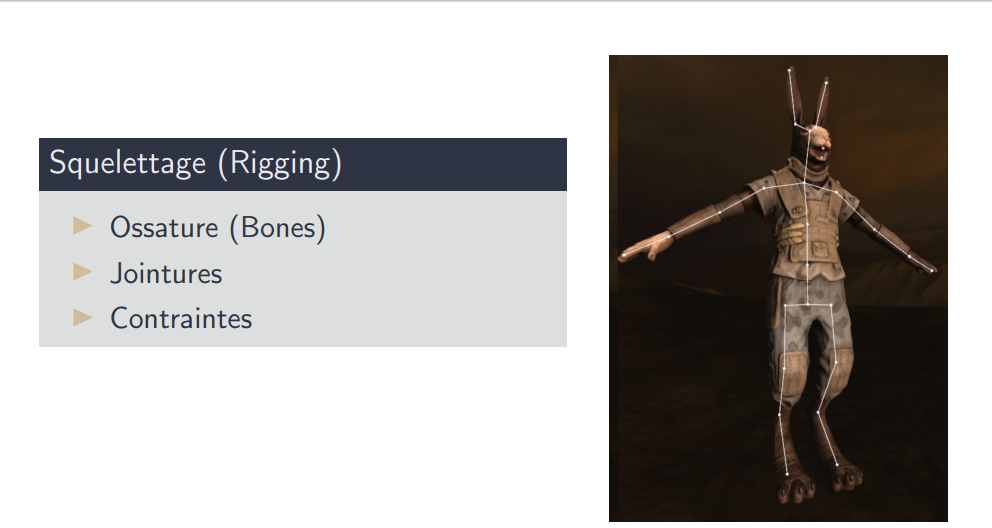
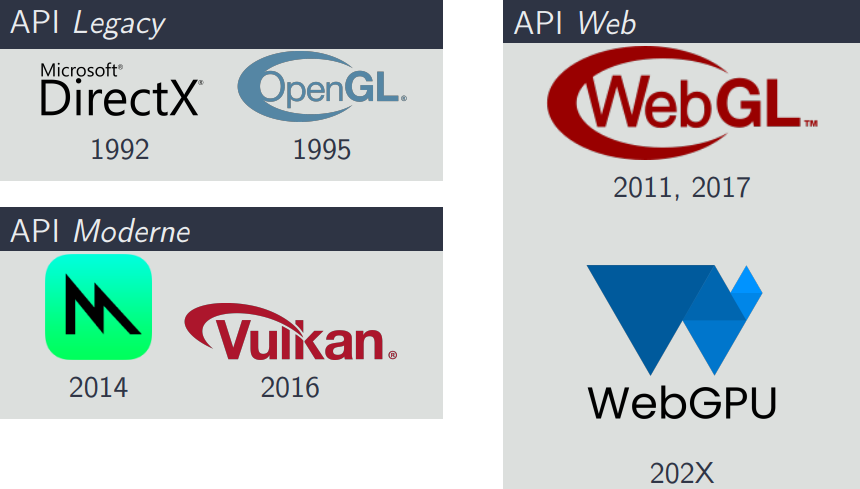
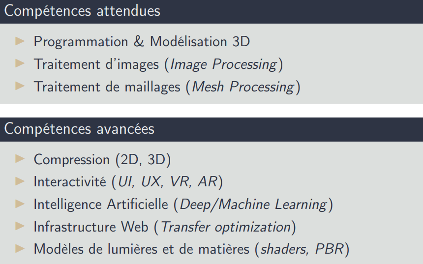

### Avant tout pour comprendre l'imagerie voici une vidéo qui explique ça en 1min:
- [Imagine - Le Parcours](https://www.youtube.com/watch?v=QdBZY2fkU-0)
# Presentation imagine:
## Résponsable:
* William Puech
* Faraj nourah
## Déboucher 
### Secteur dispo après un master imagine
* Image et Informatique graphique
* Réalités virtuelle et augmentée
* Jeux vidéo et simulateurs
### Métier possible
* #### image:
  * Chef de projet imagerie
  * Chercheur
* #### 3D:
  * Lead programmeur 3D(animation, film, simulation ...)
  * Chercheur(nombreux secteur donc le médical)

## Compétences acquises
* ### image:
  * Traitement et analyse des images
  * Génération et analyse
* ### 3D/jeux:
  * Programmation 3D et maîtrise d’algorithmes
* ### IA:
  * Intelligence Artificielle

## Master info:
Maquette du master n'est pas utile je pense mais vous pouvez la voir
* M2 en alternance

# Présentation de l'équipe du lirmm
## Voir la diapo c'est mieux pcq j'pense pas util de résumé son équipe
### Globalement ils font de la recherche sur un peu tout les secteurs de l'image (de la modélisation à la simulation et de la sécurité) ils prennent pas mal de doctorant et sont plutot chaud dans leurs secteur.

# Cas concret de l'importance de l'image
## utilisation
L'image c'est utilisé de partout, et de plus en plus (constat en ligne, dossier médical, propagande)
Du coup faut faire attention de ce qu'on en fait et surtout pas forcéments croire les images qui mtn peuvent être facilement retouchée
## Comment on detecte ça
* Analyse de la sémantique (avec un outils comme google lens par exemple ou recherche inversé)
* Les metadonnées de image (EXIF), ça contient bcp de données sur les images
* On peut faire une carte de bruit de l'image (en gros on remplace les couleurs de l'image par des ton de pixel noir et blanc ex:)

* Analyse de la distortion radial

* Détection d’une recompression JPEG

* Approche vision par ordinateur (ombre, lumière, taille, ...)

## C'est un gros challenge notamment contre la propagande. Du coup il existe des outils pour utiliser les solutions qu'on a vu:

# Professionnelle - Présentation
### sebastien beugnon
### Premier film avec des effets numériques
* Westworld (1973)
### Premier film avec de la 3D
* StarWars IV : A New Hope (1977)
### Premier film d'animations 3D
* Toy Story (1995)
### Premier film avec des rendu physique 
* Wreck-it Up (2012)
## Maintenant évolution
Premier jeux 3D en 1980 vs 2020 (cyberpunk) la diff est énorme
### On a des logiciels super puissant genre:
* SolidWorks (Dassault system) ça sert à faire de la simulation mécanique et concevoir des pièces mécanique
* AutoDesk C'est un logiciel super puissant pour les architectes
* Pas un logiciel en particulier mais on fait des scans 3D du cerveau etc dans le médical mtn
* Et le dernier challengers mtn c'est l'imprimante 3D (Dans la médecine notamment)
Faut comprendre que c'est un secteur en full expension qui évolue super vite et les perspective de carrière sont super varié
## Modélisation 3D
### Type de modèles
* Filaire (1990 environ, vielle méthode, très limité)
* Solide/Volumique ? (Pour représenté du contenue, plutot orienté simulation, très très couteux)
* Surfacique (Rendu, super-rapide, empty shell en gros ça modélise en surace l'interieur est vide)

### Sources de données 3D
* ####  CAO (ou Conception Assistée par Ordinateur)
    * Sketch 2D (Calque 2D d’un élément 3D)
    * Modèle 3D
* ####  Scans 3D
    * Photogrammétrie
    * Stéréoscopie, LiDAR, lumière structurée
### Modélisation paramétrique
* #### Parametric Design
    * Primitives : Cube, Cylindre, Cône, Sphère
    * Fonctions :
        * Courbes 2D (Béziers, Hermite)
        *  Surfaces 3D (B-Splines, NURBS)
    * Déformation : Trou, Chanfrein, Extrusion, Opérateurs booléens
    * Paramétrique : Contraintes
### Modélisation polygonale : Polyhèdre
* Détermine une surface de manière finie
* Ensemble de points P|P = {p ∈ R3} (sommets ou vertex)
* Ensemble de faces F|F = {f ∈ Pn} (où n est le nombre de sommets d’une face)
### Modélisation polygonale : Maillage
* Tableau de sommets (Coordonnées 3D)
* Tableau d’indices de sommet F|F = {f ∈ P3} (Indices de sommets)
    #### Pourquoi des triangles ?
    ▶ Primitive de surface

    ▶ 3 points suffisent pour déterminer un plan, une surface
    
### A retenir d'après la diapo

## Visualisation
En gros c'est des données 3D converti en image 2D
Pour faire ça on c'est inspiré de la nature c'est à dire:
* Un objet sans lumière on le voit pas, en réalité c'est le reflet de l'objet qu'on voit quand la lumière le touche et ça arrive à nos yeux.
* La lumière c'st une onde éléctro-magnétique, cf spectre lumineux cours du collège mdr
### La vrai définition c'est que l'onde electro-magnetique c'est ça comme paramètres:
▶ Onde transversale

▶ Fréquence

▶ Longueur d’onde λ (nm)

▶ Irradiance (Energie)
### Bref, l'idée du trucs c'est lancer des rayons de lumière (comme dans la vrai vie) pour voir ou non les object, les moteurs fonctionne comme ça, cf raycasting pour ceux qui veulent comprendre + les moteurs de jeu
## Interface Homme-Machine
L'idée la c'est de communiquer avec l'homme et la machine via le jeu/logiciel
on peut faire ça soit de manière visuel cf le GPS de the crew ou d'un autre jeu ou on voit vraiment une ligne sur le sol
ou alors on peut aussi integrer ça au jeu de manière coherente genre firewatch et la carte qui est un élements du jeu + que juste une information visuel.
## Realité augmenté & virtuelle
C'est utilisé comme un jeu mais mtn c'est très très utilisé dans la formation pro, ex:
#### VR
* Conducteur d'engin (gros tractopelle, grue etc)
#### AR
* Pokemon GO
* GOOGLE GLASS

## Animation
### 2D
La 2D c'est comme de l'animation papier, c'est à dire qu'on refait grossièrement une image de mouvement à l'autre
### 3D
On crée des jointures au niveau des membre rotatif (genou, coude etc)
et ensuite on vient crée le mouvement de ses jointure, cf la photo en dessous

## Motion Capture
J'pense tout le monde voit ce que c'est (cf le seigneur des anneaux avec gollum)
## Programmation
Pour programmer on utilise des API, cf la photo:

## Attente de l'industrie
